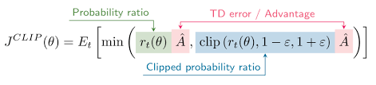
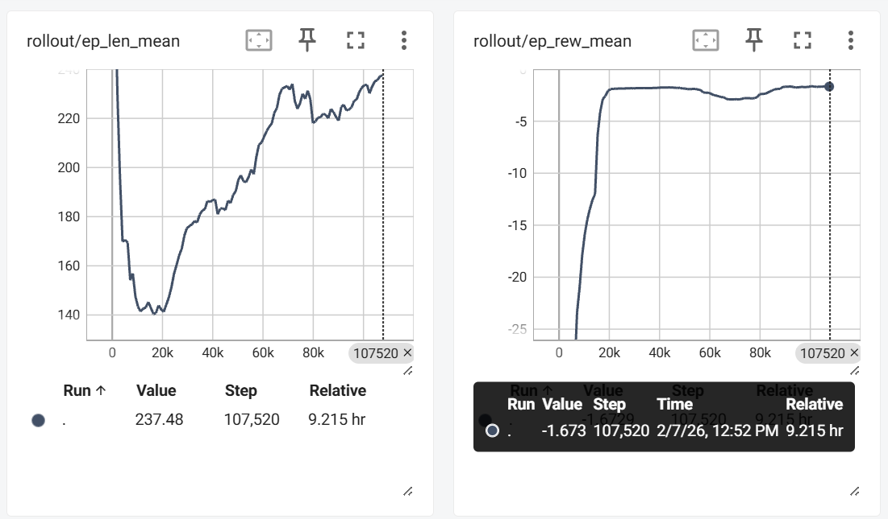
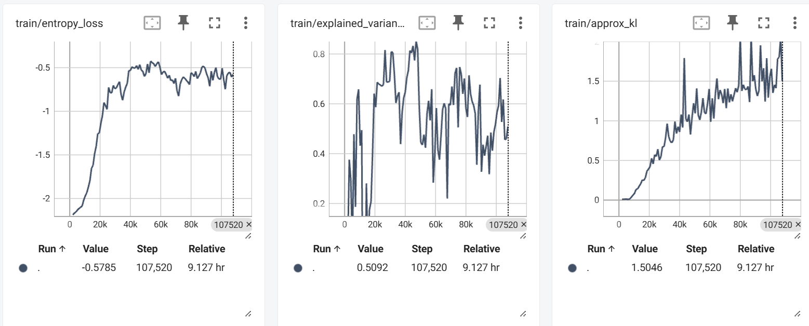
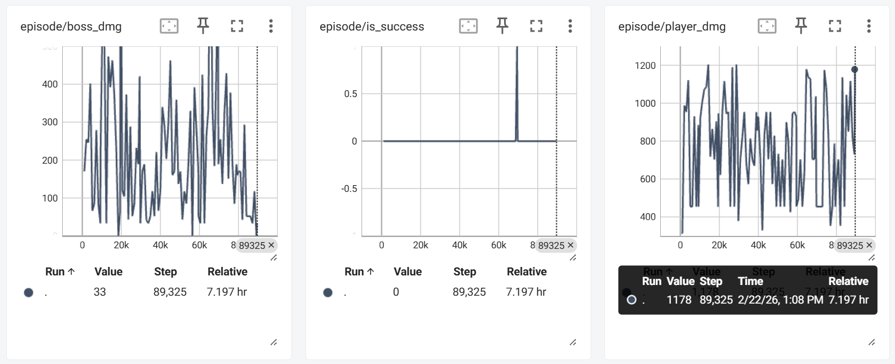
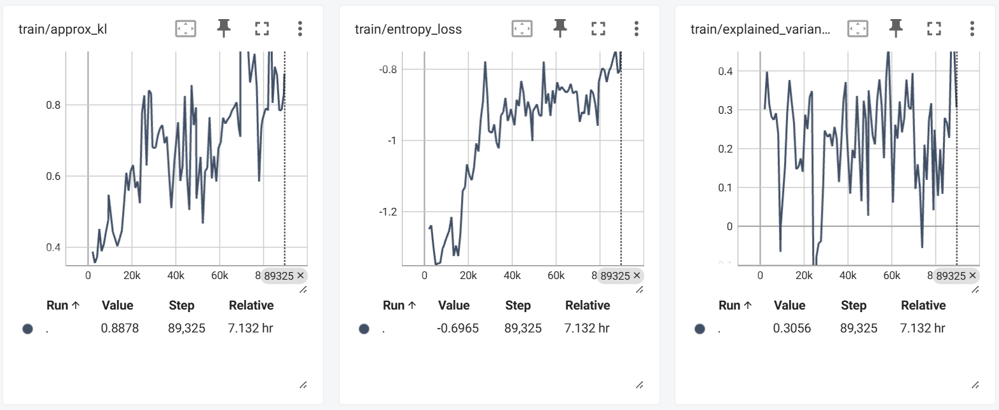
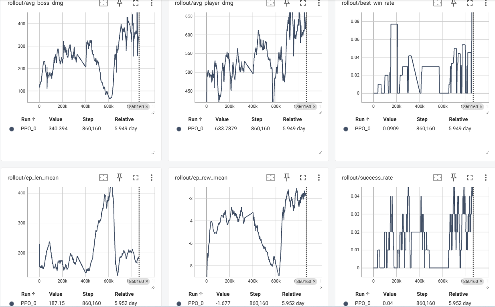
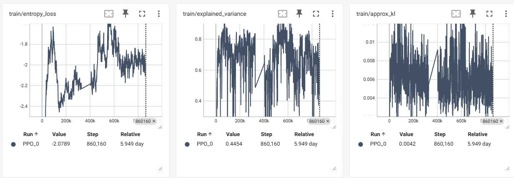

## Video (TODO)

[Embed your video here — e.g. paste a YouTube embed link or URL]

- Length: ~3 minutes recommended, 4 minutes max (strictly enforced)
- Must include: brief problem description, "before" training performance, "after" training performance
- Optional: failure modes, approach summary, future ideas
- Minimum resolution: 720p; speech must be comprehensible

---

## Project Summary

Our project, **ProximalSouls**, focuses on training an AI agent to operate in a combat environment inspired by **Dark Souls III**, a game known for its high difficulty and emphasis on precise timing. The objective of the agent is to defeat a boss by learning how to attack, dodge, and heal effectively while managing limited resources such as health and stamina. The environment is fast-paced and unforgiving, where small mistakes can quickly lead to failure. This creates a challenging setting in which the agent must learn through repeated interaction and adaptation rather than relying on predefined rules.

The motivation behind this project comes from the complexity of real-time decision-making in combat scenarios. Unlike simpler or turn-based environments, this problem requires the agent to balance multiple objectives at once, including dealing damage, avoiding incoming attacks, maintaining proper positioning, and choosing the right timing for each action. The environment also introduces challenges such as noisy observations and partial information, since the agent relies on both visual inputs and game state variables. These factors make the problem non-trivial, as there is no simple or deterministic strategy that consistently leads to success across all situations.

Reinforcement learning is essential for solving this problem because the optimal behavior cannot be easily hard-coded. Instead, the agent must learn a policy by interacting with the environment and improving based on feedback in the form of rewards. Traditional approaches would struggle to capture the nuanced timing and adaptability required in this setting. By using reinforcement learning, the agent can gradually discover effective strategies over time, leading to emergent behaviors such as dodging attacks, maintaining safe distances, and capitalizing on opportunities to deal damage, all of which are critical for success in this type of environment.

---

## Approach

Our primary method uses Proximal Policy Optimization (PPO), a policy-gradient reinforcement learning algorithm that is well-suited for continuous control and high-variance environments. PPO learns a stochastic policy that maps observations to a distribution over actions, and updates this policy using clipped objective functions to ensure stable learning. The agent collects trajectories by interacting with the environment, storing tuples of state, action, reward, and next state. These trajectories are then used to compute advantage estimates, which guide how the policy should be updated. The core objective maximizes the expected advantage while constraining updates to remain close to the previous policy. This is achieved through the clipped surrogate loss:

<figure style="text-align: center;">
    
    <figcaption>
        <small>
            <i>Figure 1: The clipped surrogate loss function</i>
        </small>
    </figcaption>
</figure>

where r_t (theta) is the ratio between new and old policy probabilities and A_t is the advantage estimate. In addition to the policy loss, PPO optimizes a value function loss to predict expected returns and includes an entropy bonus to encourage exploration. These components together allow the agent to improve steadily without making destabilizing updates.

In our environments, the observation space is composed of structured game state variables and or visual/spatial information. All values are floats normalized to the range `[0, 1]`. In the beginning, our observation space looked something like:
- `Normalized Player HP`
- `Normalized Player SP (Stamina)`
- `Normalized Boss HP`
- `Normalized Distance between Player and Boss`
- `Estus Remaining (Healing)`
- `Successful Action (Binary value denoting whether action succeeded)`
- `(128, 128, 1) pixel frame (128x128 grayscaled game capture)`

with different environments dropping 1-2 values depending on the stage of development. Our more recent environments drop the frame data entirely and exclusively use game features:
- `Normalized Player HP`
- `Normalized Player SP (Stamina)`
- `Normalized Boss HP`
- `Normalized Distance between Player and Boss`
- `Estus Remaining (Healing)`
- `Boss Animation (21 Dimensional One Hot Encoding)`
- `Player Animation (5 Dimensional One Hot Encoded)`

which form a 31-dimensionsal `Box` observation space. The loss of visual data has to be compensated by the animation information if we want the agent to still learn the timing of visual cues. Notably, the progress through each animation was not able to be obtained, meaning that regardless of how far into an animation the player or boss is in, the agent receives the same observation. While this makes timing harder, it is more realistic to how a normal human player would perceive the information cognitively, instead of fine grained progress values.

To help the agent learn the timings it needs to survive, we use a `VecFrameStack` with a buffer of 4 frames. Our time steps are defined by the frame skip `n`, where `n` is the amount of frames (60 frames per second) we skip between steps. In practice, there is "jitter" from code execution, context switching, etc. Initially our frame skip was roughly `n=6`, but we transitioned to `n=4` when we dropped the frame data.

One issue that **Dark Souls III** presents is its continuous camera space. We bypass this by using "lock on" feature provided in game, which fixes the camera on to a selected target. Certain boss attacks would break the locked on state, which would almost always end in death for the agent. This is not something we solved until after the dropping the frame data. The action space started off as a simple `Discrete` action space which would include some or all of:
- `Attack`
- `Forward Attack`
- `Movement (Cardinal directions; each gets one action)`
- `Forward Roll`
- `Backstep`
- `Heal`
- `Do not act`

We then transitioned in the no frame environment to a `MultiDiscrete` action space with `(5, 4)` dimensions:
- Axis 1 (Movement):
    - `Movement (Cardinal directions; each gets one action)`
    - `No movement`
- Axis 2 (Action):
    - `Attack`
    - `Roll/Backstep (Same input; depends on movement for actual executed action)`
    - `Heal`
    - `Do not act`

This action space is more analogous to real human gameplay, as well as allowing the agent to perform more gameplay actions without polluting a single discrete space with more hardcoded actions. As an example, the direction of rolling was hardcoded to forward in the original action space. Now, the direction of the roll is based off of the movement axis, opening up the other directions without having to hardcode each direction as a separate action. 

At each timestep, the agent selects an action based on its current policy, executes it in the environment, and receives a scalar reward. The reward function was initially designed to guide learning by incentivizing boss damage and discouraging player damage, while also incorporating penalties for inefficient behavior such as wasting stamina or taking too long. Over the course of the project, we iterated heavily on reward design, eventually simplifying it to reduce noise and improve learning stability.

Training was conducted over a variable number of timesteps. Each environment we tested would converge or perform optimally at different points. With our first environments 100,000 steps would be the goal. Our final model has been trained for far longer, reaching approximately 800,000 to 860,000 steps. We used standard PPO hyperparameters as a baseline, taken from widely used implementations such as Stable-Baselines3, including a learning rate on the order of 3e-4, a clipping parameter ϵ around 0.2, and a discount factor γ of 0.99. Additional parameters such as batch size, number of epochs per update, and entropy coefficient were initially kept at default values and later adjusted slightly based on observed training stability. For example, we monitored metrics such as approximate KL divergence and entropy loss to ensure that policy updates remained stable and not overly random. When instability occurred, such as excessively large KL divergence, we prioritized simplifying the reward function rather than heavily tuning hyperparameters. That being said, when we initially transitioned our environment, we did tune a few notable hyperparameters:
- `n_steps=1024 (default=2048)`
- `n_epochs=5 (default=10)`
- `ent_coef=0.01 (default=0.0)`
- `learning_rate=1e-4 (default=3e-4)`

with the rationale being that our observations are cleaner now, so we want to try more exploratory behavior. While we do encourage exploration, with more frequent short-sighted updates, this also introduces more risk of learning "bad" things rapidly. So we lowered the learning rate to another commonly used value, to limit how much can be learned at once.

---

## Evaluation

### Case 1

<strong>Case 1: Early Version Reward Function Code (2/1)</strong>

    
<pre><code class="language-python">
def _calculate_reward(self, prev_player_norm_hp, prev_boss_norm_hp, action):
        """Calculate reward based on state changes"""
        reward = 0.0
        
        # Reward for dealing damage to boss
        boss_damage = prev_boss_norm_hp - self.boss.norm_hp
        if boss_damage > 0:
            reward += boss_damage * 2 
        
        # Penalty for taking damage
        player_damage = prev_player_norm_hp - self.player.norm_hp
        if player_damage > 0:
            reward -= player_damage * 0.5 

        # Add penalty for being too far away; ~3 units is the
        #  attack range so little more leeway before penalty
        dist_to_boss = math.dist(self.player.pos, self.boss.pos)
        norm_dist = min(dist_to_boss, self.MAX_DIST) / self.MAX_DIST
        if norm_dist > 0.5:
            reward -= norm_dist * 0.01
        
        # Large reward for killing boss
        if self.boss.hp <= 0:
            reward += 10
        
        # Large penalty for dying
        if self.player.hp <= 0:
            reward -= 2

        if self.player.sp <= 0:
            reward -= 0.01

        #very small reward for survival (anti-suicide 0.0)
        if self.player.hp > 0:
            reward += 0.005
        
        if(action == 8):
            # penalty for wasting flask when hp is high
            HEAL_AMT = 250 #how much hp you get for healing
            missing_hp = max(0.0, float(self.player.max_hp)) - float(self.player.hp)
            wasted_flask = max(0.0, HEAL_AMT - missing_hp)
            norm_wasted_flask = min(1.0, wasted_flask / HEAL_AMT)
            reward -= 0.3 * norm_wasted_flask

            # reward for strategic healing (100 missing hp / 454) * (1 - (200/250)) -> when the wasted is less reward goes up!!!
            reward += 0.3 * (missing_hp / self.player.max_hp) * (1.0 - norm_wasted_flask)
                
            # big penalty if healed 3+ times in the episode
            self.heal_count+=1
            if self.heal_count > 3:
                reward -= 0.3 * (self.heal_count - 3) #4-3 -> neg 0.3 reward originally
        return reward
</code></pre>

    
<figure style="text-align: center;">
    
    
    <figcaption>
        <small>
            <i>Figure 2: Avg Episode Length, Avg Episode Reward, Entropy Loss, Explained Variance, Approximate KL</i>
        </small>
    </figcaption>
</figure>

#### **Case 1 Quantitative Analysis**

Looking at our reward function, one might notice it is very complex due to it’s intention to shape behavior towards dealing damage, avoiding damage, keeping within attack range of the boss, killing the boss, survival, and using an Estus Flask (heal) strategically. With all these categories, which our earlier models focused on, have a wide gap for the agent to learn from, since every behavior can lead to a reward number, but shaped by a huge number of categories, which is difficult to define. This, causes the agent to have trouble learning what is right from wrong, due to an unclear definition via noise in our reward function. 

Looking into `rollout/ep_len_mean` in *Figure 2* , we can see at first, the episode length is very short, but as time goes on, episodes get longer, meaning the agent is learning how to survive. However, analyzing the agent’s behavior in the qualitative analysis below proves this survival was incentivized through an exploitations of a survival reward, which was not intended. Looking at the `rollout/ep_rew_mean` in *Figure 2*, shows that for the first roughly 20k steps, the agent is not doing well, but then slowly starts increasing it’s reward heavily. This can be attributed to the same survival reward exploitation. The `train/approx_kl` in *Figure 2* shows a rise from 0 to about 1.5, which is pretty high for PPO, meaning that the policy was not stable enough for the agent to learn. The `train/explained_variance` oscillated a lot and ended up at 0.5, which is not super close to 1.0 (the target value), meaning that the agent is not able to predict returns, which makes updates noisy and unreliable. So the entropy loss ends up climbing and plateauing around -0.5 which means the policy just grew to be uncertain, since negative indicates the policy is more random, and it steadily stayed at this -0.5 range. 

#### **Case 1 Qualitative Analysis**

<iframe
    src="https://www.youtube.com/embed/-yDiVhrWwZ4"
    style="width:100%; aspect-ratio: 16/9;"
    allowfullscreen> 
</iframe>

Analyzing the only model saved from this environment (10,000 step model), the agent consistently rolls, to reduce damage taken. It also occasionally hits the boss. However, at this time, whenever the agent would go in an opposite direction of the boss, we did not have the auto-focus implemented yet, so the agent had no way to “see” the boss. Also, the later models from this training session were not saved due to the rolling action being repeated, since it allowed the exploitation of a small survival reward. Another action that was not used in this model, despite having the capability, was heal. We believe this happened because the maximum reward for healing is tiny compared to survival, or damage rewards. Additionally, in early episodes, the agent was dying quickly, which means the heal optimization (healing when at lower HP to maximize the healing received) rewards did not apply to the agent, which also disincentivized healing, eliminating it from being a “good” action. Overall, this model converged to bad behavior, which means timing is significant when training a model. Additionally, its behavioral convergence to rolling might imply training in phases is better for an agent to learn specific behaviors, whcih can possibly be combined later.

---

<strong>Case 2: Intermediate Version Reward Function Code (2/21)</strong>

<pre><code class="language-python">
def _calculate_reward(self, prev_player_norm_hp, prev_boss_norm_hp, action):
    """Calculate reward based on state changes"""
    ATTACK_ACT = (1,)
    DEFENSE_ACT = (2,3)
    HEAL = (8,)

    reward = 0.0
    # Reward for dealing damage to boss
    boss_damage = prev_boss_norm_hp - self.boss.norm_hp
    dist_to_boss = self._safe_dist()
    norm_dist = min(dist_to_boss, self.MAX_DIST) / self.MAX_DIST
    player_norm_hp = float(self.player.norm_hp)
    hp_gain = max(0.0,  player_norm_hp - prev_player_norm_hp)
    
    if boss_damage > 0:
        reward += boss_damage * 12 #inc
        #reward good attacking (damages boss with action)
        if action in ATTACK_ACT:
            reward += 0.10
        if player_norm_hp < 0.30: #force heal discourage attack at low hp
            reward -= 0.05
    else:
        reward -= 0.003

    if action in ATTACK_ACT:
        if norm_dist <= 0.30:
            reward += 0.03
        else:
            reward -= 0.03  # bigger whiff penalty than -0.01

        # penalty for attacking when low hp and we have potions
        if player_norm_hp < 0.35 and self.heal_count <= 3:
            reward -= 0.20
    
    # Penalty for taking damage
    player_damage = prev_player_norm_hp - self.player.norm_hp
    if player_damage > 0:
        low_hp_scale = 1.0 + (1.0 - player_norm_hp) * 2.0 #1-2
        reward -= player_damage * 5 * low_hp_scale #decreased
        
    # Add penalty for being too far away; ~3 units is the
    #  attack range so little more leeway before penalty
    if norm_dist > 0.55:
        reward -= 0.04 * (norm_dist - 0.55) / 0.45
    
    # Large reward for killing boss
    if self.boss.hp <= 0:
        reward += 15
    
    # Large penalty for dying
    if self.player.hp <= 0:
        reward -= 6 #increased by 1x

    # better stamina rewards that slowly discourages high sp use
    sp_frac = 0.0
    if float(self.player.max_sp) > 0:
        sp_frac = float(self.player.sp) / max(1.0, float(self.player.max_sp))
    if sp_frac < 0.10:
        reward -= 0.02
    if self.player.sp <= 0:
        reward -= 0.03

    if hp_gain > 0: #the heal went through
            reward += hp_gain * 0.05
            self.heal_count += 1 

    #pressure to quickly punish boss instead of rewarding random rolling and surviving actions
    reward -= 0.007
    if player_norm_hp < 0.25 and self.heal_count < 3 and action not in HEAL:
        reward -= 0.05
    if(action in HEAL):
        # penalty for wasting flask when hp is high
        HEAL_AMT = 250
        missing_hp = max(0.0, (float(self.player.max_hp) - float(self.player.hp)))
        wasted_flask = max(0.0, HEAL_AMT - missing_hp)
        norm_wasted_flask = min(1.0, wasted_flask / HEAL_AMT)
        if(float(self.player.max_hp) > 0): #only when hp is valid we calculate rewards using hp 
            hp_frac = float(self.player.hp) / max(1, float(self.player.max_hp))
            #penalty for healing with high hp
            if hp_frac > 0.65 : #since health potion is roughly half of the players hp
                reward -= 0.2
            #reward healing at low health
            if hp_frac <= 0.55: #perfect percent for none wasted ...
                reward += 0.6 * (1.0 - norm_wasted_flask)
        
        # penalty if healed 3+ times in the episode
        if self.heal_count > 3:
            reward -= 0.05 * (self.heal_count - 3)
    return reward
</code></pre>

    

<figure style="text-align: center;">
    
    
    <figcaption>
        <small>
            <i>Figure 3: Damage Taken, Damage Dealt, Approximate KL, Entropy Loss, Explained Variance</i>
        </small>
    </figcaption>
</figure>

#### **Case 2 Quantitative Analysis**

For another look into one of our intermediate models, our observation space was still based on game internal values and a pixel frame. However, this time, our reward function was even more detailed than our earlier one. Boss damage reward was increased from 2 to 12, the death penalty also increased from -2 to -6. This time, we also added a time pressure penalty of -0.007 per step, which was meant to stop the initial survival reward exploitation. Player damage was also increased to player damage multiplied by 5, and a scale of how low the agent’s HP is relative to it’s total HP. Despite, these specified changes, the graphs show that the agent fails to converge to a steady combative behavior. The `episode/boss_dmg` in *Figure 3* shows consistent oscillation, ranging from about 50 and 500, which tells us the model does not converge to a behavior that leads to similar amounts of damage throughout episodes. In terms of “success”, which would mean a boss kill, the model was only able to get one across 89,325 steps. Since metrics such as boss damage, varied a lot per episode, this success could be attributed to luck, instead of a stable policy. Additionally, the `episode/player_dmg` in *Figure 3* was averaged around a high value (~400-1200), meaning that the low HP scale multiplier for damage taken was as effective since there was no clear decrease in the agent’s damage taken during training.

The training values tell use more about why this model failed in certain aspects. For example, `train/approx_kl` in *Figure 3* should lean towards a value of 0.02, but instead started at about 0.4, and climbs to about 0.88, meaning the updates are too large, making the policy unstable.  Looking at `train/explained_variance` in *Figure 3*, we can also see values changing throughout, and eventually landing at 0.31, which is worse than Case 1’s 0.5. Thus, this model has a hard time predicting returns, which is probably due to the more complex reward shaping compared to Case 1, making it hard to estimate consistently. Finally, `train/entropy_loss` climbs from a very negative value of -1.3 towards -0.7 by the end, which is still more random than Case 1’s endpoint of -0.5. This means the policy is still uncertain and has not committed to a reliable policy, causing stats such as player damage and boss damage to very hugely per episode. Overall these trends, suggest scaling up reward magnitudes, adding time pressure, and generally having a more specific heal reward setup brought up the underlying issue of reward complexity and signal noise we had struggled to identify as a problem.

#### **Case 2 Qualitative Analysis**

<iframe
    src="https://www.youtube.com/embed/uVrzh4vpu6A"
    style="width:100%; aspect-ratio: 16/9;"
    allowfullscreen> 
</iframe>

The model we ran was from around the timestep that the agent succeeded in defeating the boss, so at 69,437 steps. As seen in the video, the agent has learned to roll, which significantly decreases the damage taken from the boss. This means our damage taken penalty has worked in some aspect, since the agent chooses to roll as a core movement, which leaves the agent in a few invulnerability frames (not able to take damage). However, the timing of rolling and healing is not adequate, which causes variance in how the agent performs. **Dark Souls III** requires precise timing since one wrong action can lead to termination, so when the agent decides to heal when at low HP, but in range where the boss could hit it, this leads to the end of an episode depite the "good" choice to efficiently heal. Since the observation space is still noisy with the frame data oversaturating the actual game signals, we can attribute the timing issues to the environment, as well as a noisier, complex reward function.

---

### Case 3

<strong>Case 3: Most Recent Version Reward Function</strong>

<pre><code class="language-python">
def _calculate_reward(self, prev_player_norm_hp, prev_boss_norm_hp, player_norm_min, boss_norm_min, action):
    a = np.asarray(action).squeeze()
    if a.shape == (2,):
        move, act = int(a[0]), int(a[1])
    else:
        # fallback if something weird happens
        act = int(np.asarray(action).ravel()[-1])

    reward = 0.0

    boss_damage = prev_boss_norm_hp - self.boss.norm_hp
    player_damage = prev_player_norm_hp - self.player.norm_hp

    reward += boss_damage * 12

    # stage 1: player will get neg reward for taaking damage
    if player_damage > 0:
        reward -= player_damage * 1.5

    if act == 2 and self.estus == 0:
        reward -= 0.5

    if self.boss.hp <= 0:
        reward += 5

    # stage 1: in range attack reward
    dist_to_boss = self._safe_dist()
    norm_dist = min(dist_to_boss, self.MAX_DIST) / self.MAX_DIST
    if act == 0 and norm_dist <= 0.35:
        reward += 0.03

    # stage 1: survival bonus only if we damage and trade well...
    if boss_damage > 0 and player_damage == 0:
        reward += 0.05

    if self.boss.norm_hp < 0.5:
        reward += 0.01

    if self.player.hp <= 0:
        reward -= 5

    if self.player.sp <= 15:
        reward -= 0.01

    reward -= 0.005

    return reward
</code></pre>

    

<figure style="text-align: center;">
    
    
    <figcaption>
        <small>
            <i>Figure 4: Damage Taken, Damage Dealt, Moving Best Win Rate (Last 100 episodes), Avg Episode Length, Avg Episode Reward, Overall Success Rate, Entropy Loss, Explained Variance, Approximate KL</i>
        </small>
    </figcaption>
</figure>

#### **Case 3 Quantitative Analysis**

For our most recent, and most trained model, the reward function was extremely simple compared to our previous tests. For our first ~400,000 steps of this model, we only gave a huge positive reward for doing damage to the boss. Then, we decided to tweak the function to add a penalty for the player taking damage, which was ran up until around 600,000 steps. As seen in the graphs, the “small” penalty was `normalized damage taken * 4`, while the boss damage was `normalized damage dealt * 10`. This changed behavior dramatically, as the player no longer did as much damage to the boss as seen by the huge decline in `rollout/avg_boss_dmg` in *Figure 4*. After realizing the reward tweak was too over dominating, we lowered the damage taken reward to a scaler of 1.5. After this change, average boss damage was higher than we had seen initially, meaning it is possible the agent was learning how to maneuver better possibly due to the mishap of the initial huge penalty given to taking damage. 

The rollout metrics have shown an upward trend, constituting learning over the long almost 6 day training. The `rollout/ep_rew_mean` in *Figure 4* shows a huge increase, then of course a downward trend in the section where we added an overbearing penalty to damage taken. This is followed by a huge upward trend, once the penalty weightings were adjusted properly. For episode length, if we look at the `rollout/ep_len_mean` in *Figure 4*, it climbs from around 150 to 400 before settling around 180 by the end of training. This suggests the agent had explored survival tactics, such as rolling and dodging rather than just attacking the boss with the `normalized damage taken * 4` penalty. The success rate logged in `rollout/success_rate` is the rate at which we killed the boss, which fluctuates a lot throughout training, and hovered around 2-4%. On the other hand, our `rollout/best_win_rate`, which was a metric of how many wins the agent achieved in a moving window of 100 episodes, which peaked at around 9.09%, which was significantly better than in our previous Case 1 and 2 environments, with nearly 0 successes. Additonally, the `rollout/avg_boss_dmg` in *Figure 4* is continuting to grow. It remains around 634 by the end of training, and the graph indicates the agent is increasing it’s damage to the boss across episodes. 

Another metric that has improved is the `train/approx_kl`, which has stayed around 0-0.01 for the entirety of our 860,000 steps, and ending at 0.0042, which is far closer to the healthier range of PPO (0.02) than Case 1’s 1.5 and Case 2’s 0.88. We can derive that due to the simplified reward function, we produced a consistent, more controlled reward output, which allowed policy updates to stay small and steady. The `train/entropy_loss` stays in the -1.8 to -2.4 range, which compared to Case 1 and 2 was more negative, indicating that the policy was more decisive and committed to certain actions which yielded a stable similar reward each episode. As for the `train/explained_variance`, it oscillates between 0.4 and 0.8, ending at around 0.45. Compared to Case 1 (0.5) and Case 2 (0.31), Case 3 sits in the middle. The important difference though, is the shape of the graphs. For example, Case 1 and Case 2 had graphs that were chaotic from the start, whereas Case 3 climbs in the middle of training, before dropping back down. This suggests the dodge/roll defensive actions were learning well, before the policy was changed to encourage more damage. Although the target value is 1.0, the reason it never gets to this value, is mostly likely because the boss has varied patterns of attacks, and a single mistimed action could lead to the episode’s end which could have been going well up until that point. 

#### **Case 3 Qualitative Analysis**

<iframe
    src="https://www.youtube.com/embed/Lb8OTMaF1oY"
    style="width:100%; aspect-ratio: 16/9;"
    allowfullscreen> 
</iframe>

One important thing to note is that the agent no longer has any healing rewards, meaning it has implicitly learned to heal in order to deal more damage to the boss. Additionally, the agent has learned to dodge backward, and avoids getting hit by the boss’s first 3 attacks. Although this behavior isn’t perfect, and the timing can be off, it’s still proof of learning to avoid damage by developing pattern recognition. Another behavioral change is the agent’s ability to damage the boss, usually doing around more than half of the boss’s HP. With further heal optimization and smaller reward tweak phases, this damage along with the ability to stay alive, could yield higher success outcomes. Another reason success might have been harder, was due to character choice. We chose the **Knight** class since it has more well balanced stats overall, however, since our current model has learned to focus on damage, choosing another character, such as the **Warrior** class, who does more damage, may lead to higher win rates, and better learning for this specific model. Cursory evaluation using a **Warrior** dropped into our models does show promising potential.

---

## Resources Used

## **Code & Libraries:**
- Stable-Baselines3 for the PPO implementation and training framework
- Gymnasium to build our custom **Dark Souls III** environment
- [pymem](https://pypi.org/project/Pymem/) for reading structured game state values directly from **Dark Souls III** memory
- [The Grand Archives](https://github.com/The-Grand-Archives/Dark-Souls-III-CT-TGA) for providing a foundation for memory data extraction
- [vgamepad](https://github.com/yannbouteiller/vgamepad) (virtual XBox360 controller), which utilizes [ViGEmBus](https://github.com/nefarius/ViGEmBus), for executing agent actions
- [mss](https://pypi.org/project/mss/) for capturing game frames
- [Boss Arena](https://www.nexusmods.com/darksouls3/mods/1854) mod for **Dark Souls III**, which enables rapid access to the boss encounter and significantly reduces reset time between episodes, improving training efficiency and experimental control
- [Source Code](https://github.com/dustinlgit/darksouls-ai) for ProximalSouls

## **Documentation & Tutorials:**
- [Stable-Baselines3 PPO](https://stable-baselines3.readthedocs.io/en/master/modules/ppo.html) documentation
- If you are interested in a more detailed look into our quantitative results, [**here**](https://www.notion.so/f916c32285374e89a0cf2b161c35af28?pvs=21) is a spreadsheet put together by Leah of her specific runs and documentation throughout training.

## **Other Websites / Links:**
- [Black Myth Unified](https://jack-emerald.github.io/BlackMyth-Unified_Mind/index.html) is a past group that tackled another "soulslike" game, giving us the inspiration for this project
- [Omni's Hackpad](https://badecho.com/index.php/2020/09/25/hacking-dark-souls-iii-part-1/) for giving us the idea to extract features directly from memory instead of through frame data

**AI Tools Used:**
- Tools: ChatGPT, Claude, Gemini
    - Used for: 
        - Clarifying PPO theory and debugging conceptual reinforcement learning issues
        - Refining reward design
        - Improving report clarity
        - Debugging codebase
        - Example snippets for libraries
    - Where it appears: 
        - Project Summary 
        - Various parts of the environment code
            - `controller.py` mostly AI generated with manual tweaking
            - Translating certain assembly portions of [The Grand Archives](https://github.com/The-Grand-Archives/Dark-Souls-III-CT-TGA) to Python
            - Most code was not directly generated but tweaked/debugged
        - Callbacks in `train.py`
        - Formatting/styling of the report was tweaked with the help of AI