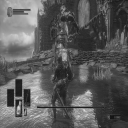
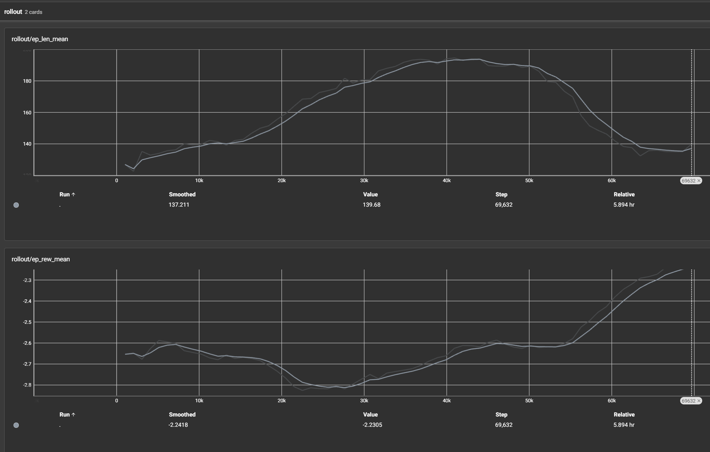
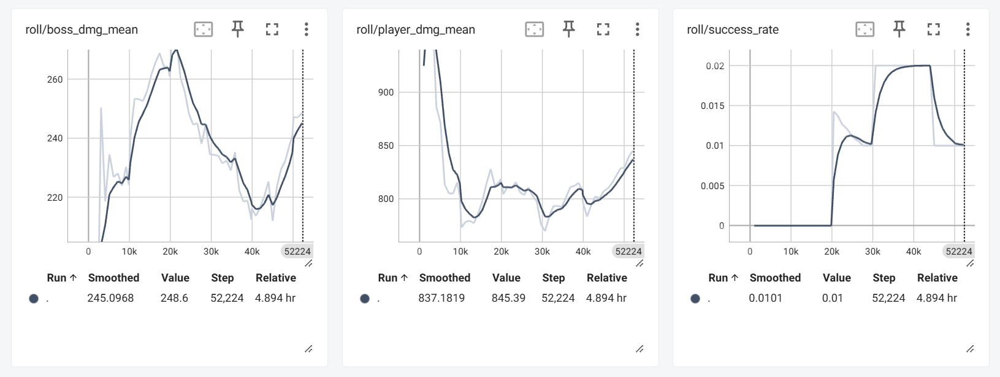

## Project Summary

This project develops a reinforcement learning agent capable of fighting the first boss in *Dark Souls III* using Proximal Policy Optimization (PPO). The agent interacts with the live game by combining data read from memory (e.g., player health, stamina, boss health, positional data) with raw screen pixel observations. Actions are executed through simulated controller inputs, allowing the model to perform attacks, dodges, movement, and healing in real time. The goal is to learn a combat policy that maximizes survivability and boss damage without relying on scripted logic. By training from scratch against Iudex Gundyr (the first boss), this project explores whether a model-free policy-gradient method can learn adaptive, timing-sensitive combat strategies in a high-difficulty, partially observable 3D environment.

## Approach

We formulate the boss fight as a reinforcement learning problem and train an agent using Proximal Policy Optimization (PPO). PPO is a policy-gradient method that improves training stability by optimizing a clipped surrogate objective rather than directly maximizing the raw policy gradient. The clipped objective constrains policy updates to remain close to the previous policy, preventing destructive updates that can destabilize training. The optimization objective includes a policy loss term, a value function loss for critic learning, and an entropy bonus to encourage exploration. We use the Stable-Baselines3 implementation of PPO and train the model from randomly initialized weights.

The environment is a gym environment, built as a custom interface to *Dark Souls III*. The agent interacts with the game by reading structured values directly from memory and capturing the game screen as image input. Memory features include player HP, player stamina, player animation, boss HP, and positional coordinates for both player and boss. From these values, we compute additional features such as relative distance between the player and the boss. These structured inputs provide clean, low-noise state information that would otherwise be difficult and computationally expensive for the model to infer from pixels alone.

In addition to memory features, the agent receives raw pixel observations captured from the game window. The frames are resized (128x128) and grayscaled, to cut down on unnecessary color noise, before being passed into a convolutional neural network (CNN). We are using Stable-Baselines's frame stacking (`VecFrameStack(env, 4)`) to stack the last 4 captured frames.

<figure style="text-align: center;">
    
    <figcaption>
        <small>
            <i>Figure 1: Downsized and grayscaled 128x128 frame capture</i>
        </small>
    </figcaption>
</figure>

The CNN should extract spatial features such as boss animation cues, attack windups, and environmental layout. The memory features are processed through a multilayer perceptron (MLP). The outputs of the CNN and MLP are concatenated into a shared latent representation that feeds into both the policy head and value head of the PPO architecture. This hybrid observation design allows the model to leverage both structured state information and visual context.

Our agent uses the lock on feature that *Dark Souls III* offers, which centers the camera on the boss. This allows us to reduce complexity by not having to worry about the continuous camera space. The action space is discrete (`Discrete(9)`), and each action triggers a predefined simulated sequence of (XBox360) controller inputs such as:
- No action
- Light attack
- Dodge
- Dodge roll
- Directional movement
- Use flask (healing)

The reward function is shaped to encourage effective combat behavior. The agent receives positive reward proportional to boss health reduction and a large terminal reward for defeating the boss. It receives negative reward for taking damage and a significant penalty for player death. As healing resources are limited per combat encounter, rewards for optimal usage (more HP healed), and penalties for inefficient usage are used. In addition, the relative distance between the player and boss is rewarded when small (in range to attck), and becomes punished if the agent moves too far away. This reward structure encourages aggressive but survivable strategies, balancing survival with reasonable damage output.

## Evaluation

Quantitatively speaking, the one metric we care about the most is success rate, the rate at which we defeat the boss. While not explicitly shown in **Figure 2.1**, and with differing metrics in **Figure 2.2**, the graphs show the improvement in success rate over different iterations of reward shaping and training. **Figure 2.1** ends where the agent achieved its first victory. It took the agent ~70,000 steps to achieve this. In **Figure 2.2** it took noticeably less steps, while also achieving more successes (albeit not many) in a smaller overall time frame compared to **Figure 2.1**. In other words, our agent is learning faster and better now compared to when we first met our minimum goal of achieving one victory.

<figure style="text-align: center;">
    
    <figcaption>
        <small>
            <i>Figure 2.1: Average Reward and Episode Length</i>
        </small>
    </figcaption>
</figure>
<figure style="text-align: center;">
    
    <figcaption>
        <small>
            <i>Figure 2.2: Average Boss Damage Taken, Average Player Damage Dealt, Success Rate</i>
        </small>
    </figcaption>
</figure>

<figure style="text-align: center;">
    
    <figcaption>
        <small>
            <i>Figure 3: Poor qualitative performance</i>
        </small>
    </figcaption>
</figure>

**Figure 3** shows an example of bad qualitative performance. The agent stays away from the boss, misses attacks (due to its distance), and mistimes dodge rolls, ending with the agent taking substantial damage while outputting none in return. This sort of bad qualitative performance is expected at the start of training, but as training moves forward, we use this visual qualitative analysis to shape the reward towards avoiding bad behavior. A common issue at the start was behavior similar to this short example even after training, which we were able to mitigate with different reward shaping.

<figure style="text-align: center;">
    
    <figcaption>
        <small>
            <i>Figure 4: Good qualitative performance</i>
        </small>
    </figcaption>
</figure>

In contrast, **Figure 4** shows an example of good qualitative performance after training. The agent times rolls correctly and positions itself to avoid boss attacks. It no longer stays so far away from the boss that interaction is impossible. It attacks the boss and deals damage without putting itself at risk of taking too much damage in return. While not perfect gameplay, this behavior shows that our agent has learned to fight the boss in a more streamlined manner.

## Remaining Goals and Challenges

So far, it has been difficult shaping rewards in an agreeable way. One of our earliest issues was the agent refusing to get close to the boss, and if it did, refusing to attack the boss. We have resolved this now, but we still face other challenges. We have trained using many different evualtion mindsets to shape the rewards, but most of the time the agent starts to learn to prioritize one certain action since it yields a high reward. It most likely learns this behavior because, while killing the boss gives a very large reward, it's sparse, so the agent tries to maximize rewards by other means. To be more specific, there have been times where our model trained overnight only for the agent to be rolling around, and healing a lot, instead of taking offensive actions. At the moment, some overnight runs yield a success(es), meaning that our agent was able to defeat the boss. Although this is good, we still struggle with attaining a model with a consistent success rate, so we are still working on bridging the gap between occassional and consistent success.

For that reason, our main goal for the rest of the quarter is to achieve high consistency in killing the boss. Time remains the greatest obstacle for us. Shaping behavior through rewards is very time intensive.There is no way to simulate *Dark Souls III* headlessly, so training time is limited to the speed at which the game can be played. It is a graphically intensive game making paralell training non-feasible. Another persistent issue will be the overfitting of agent behavior and its convergence on taking a small subset of actions.

Regardless, we have several potential avenues to explore in order to optimize performance. Our actual goal for the agent to kill the boss is very sparse, so we may try a different training loop that allows the agent to replenish HP as it takes damage, but it would still incur penalties corresponding to if the agent would have died or taken that damage. This way the agent can explore actions leading to our goal (boss death) consistently rather than on occassion, while detrimental actions retain their meaning.

Another possibility is breaking up our action space into a `MultiDiscrete` space, where movement and other actions (dodge, attack, heal) are separated into their own `Discrete` spaces, allowing the agent to perform more fine grained actions. This would probably cause training to take longer, but could lead to better convergence behavior.

A potential issue to fix is how the environment handles time steps. Currently the agent chooses a new action at every step, but it doesn't always go through since *Dark Souls III* actions take a certain amount of time to execute. We have a flag in each observation passed to the agent that represents if an action follows through or not, but this is not a bulletproof method for teaching the agent. Our frame captures are also tied to each step, and that limits frame captures to ~4-8 frames per second. This is possibly not enough data to learn timing and action cues. A way to induce an action lockout, and or capturing more frames per second could lead to faster training and final performance.

Lastly, we accidentally continued training on a model once when the frame capture broke. Rewards plummeted steeply, but eventually recovered to baseline values over time. This leads to the possibility of training purely off of non-visual information retrieved from memory. This could provide insight as to the best way to approach reinforcement learning for *Dark Souls III*. Whether visual, scalar, or a mix of both is the most optimal approach.

## Resources Used

##### Reinforcement Learning
- Stable-Baselines3 for the PPO implementation and training framework
- Gymnasium to build our custom *Dark Souls III* environment
- PyTorch for neural network computation and model architecture
- Official Stable-Baselines3 and PyTorch documentation for hyperparameter configuration and architecture setup
- Online reinforcement learning resources and PPO research discussions for understanding the clipped objective and generalized advantage estimation
- StackOverflow and technical forums for debugging implementation and environment-integration issues

##### Interface and Environment Utilities
- [pymem](https://pypi.org/project/Pymem/) for reading structured game state values directly from *Dark Souls III* memory
- [The Grand Archives](https://github.com/The-Grand-Archives/Dark-Souls-III-CT-TGA) for providing a foundation for memory data extraction
- [vgamepad](https://github.com/yannbouteiller/vgamepad) (virtual XBox360 controller), which utilizes [ViGEmBus](https://github.com/nefarius/ViGEmBus), for executing agent actions
- [mss](https://pypi.org/project/mss/) for capturing images
- [Boss Arena](https://www.nexusmods.com/darksouls3/mods/1854) mod for *Dark Souls III*, which enables rapid access to the boss encounter and significantly reduces reset time between episodes, improving training efficiency and experimental control

##### AI Usage
- AI tools (including ChatGPT) for
- clarifying PPO theory and debugging conceptual reinforcement learning issues
- refining reward design
- improving report clarity
- debugging codebase

## Video Summary

<iframe
    src="https://youtube.com/embed/lqRnJzHMX5Q"
    style="width:100%; aspect-ratio: 16/9;"
    allowfullscreen> 
</iframe>